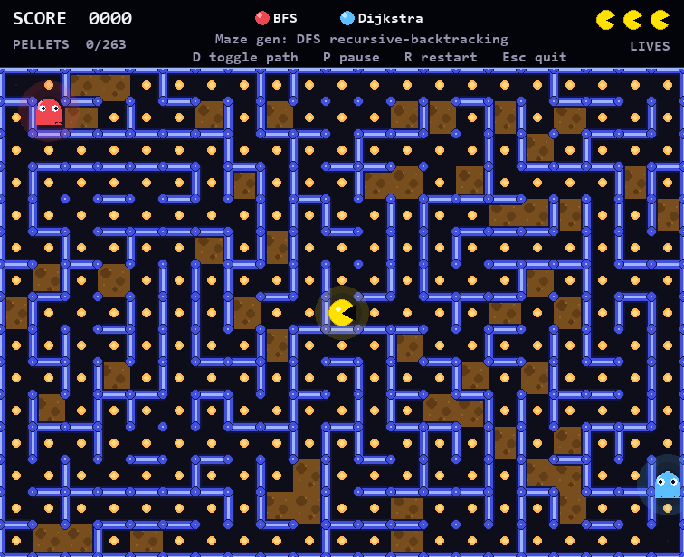
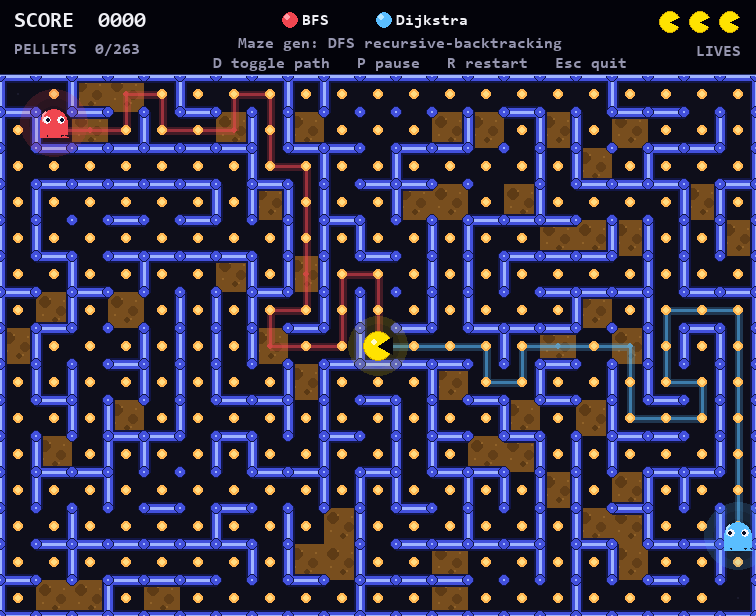

# 🕹️ Maze Chase — Pacman Algorithm Demo

> A Pac-Man-style maze game built with **Python + Pygame** that visualizes classic graph traversal algorithms in real time.  
> Created as a project for the **Design and Analysis of Algorithms (PAA)** course at ITS Surabaya.



---

## 🎯 Overview

This project uses a Pacman-inspired maze game as a sandbox to demonstrate three fundamental algorithms, each assigned a distinct role:

| Algorithm | Role | Description |
|-----------|------|-------------|
| **DFS** (Depth-First Search) | Maze Generation | Uses recursive backtracking to carve a perfect maze |
| **BFS** (Breadth-First Search) | Red Enemy AI | Chases the player via unweighted shortest path |
| **Dijkstra's Algorithm** | Blue Enemy AI | Chases the player via weighted shortest path — avoids mud tiles, making it smarter in practice |

The path each enemy is taking can be toggled on-screen for educational visualization.



---

## 🗂️ Project Structure

```
Pacman-Algorithm-PAA/
├── main.py          # Entry point — game loop and pygame init
├── game.py          # Core game logic, state management
├── entities.py      # Player and enemy entity classes
├── maze.py          # Maze generation (DFS recursive backtracking)
├── renderer.py      # Drawing and visual rendering
├── settings.py      # Constants (screen size, FPS, colors, etc.)
├── algorithms/      # BFS and Dijkstra implementations
└── requirements.txt
```

---

## 🚀 Getting Started

### Prerequisites

- Python 3.8+
- pip

### Installation

```bash
# Clone the repository
git clone https://github.com/RayhanAurelia/Pacman-Algorithm-PAA.git
cd Pacman-Algorithm-PAA

# Install dependencies
pip install -r requirements.txt
```

### Running the Game

```bash
python main.py
```

---

## 🎮 Controls

| Key | Action |
|-----|--------|
| `Arrow Keys` / `WASD` | Move Pac-Man |
| `P` | Pause / Resume |
| `D` | Toggle AI path visualization |
| `R` | Restart level |
| `Esc` | Quit |

---

## 🧠 Algorithm Details

### DFS — Maze Generation
The maze is procedurally generated each run using **recursive backtracking** (a form of DFS). Starting from a random cell, it carves passages by visiting unvisited neighbors in random order, backtracking when stuck. This guarantees a perfect maze (exactly one path between any two cells).

### BFS — Red Enemy
The red ghost uses **Breadth-First Search** to find the shortest path to the player in terms of number of steps. Since all edges are treated as equal weight, BFS is optimal for an unweighted grid and is fast to compute.

### Dijkstra — Blue Enemy
The blue ghost uses **Dijkstra's algorithm** on a weighted graph where certain tiles (e.g., mud) have higher traversal costs. This makes the blue enemy behave more intelligently — it takes slightly longer routes to avoid slow terrain, resulting in a different (and often more threatening) chase pattern.

---

## 📦 Dependencies

```
pygame>=2.5
```

---

## 📄 License

This project was developed for academic purposes as part of the PAA (Perancangan dan Analisis Algoritma) course at **Institut Teknologi Sepuluh Nopember (ITS) Surabaya**.
